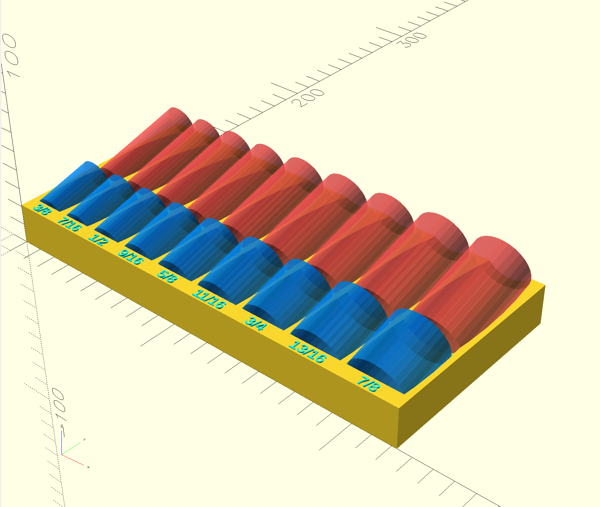

# Customizable Socket Tray with Tilting Angles

This is an enhanced fork of the "Customizable Socket Tray + Divider & Height Offset" by Breno Auto Garage from [Thingiverse](https://www.thingiverse.com/thing:5219283), which was itself a remix of Russell Stout's original "Customizable Socket Tray".



## Project History

1. **Original Design**: Russell Stout (driftfox) - Created the foundational parametric OpenSCAD socket tray
2. **First Enhancement**: Breno Auto Garage - Added divider wall and height offset features
3. **This Fork**: Added advanced tilting angles, visualization, and intelligent geometry

## Original Features (Russell Stout)

The original design provided:
- Fully parametric OpenSCAD socket tray generator
- Customizable socket diameters and labels
- Adjustable wall thicknesses and clearances
- Text embossing/engraving options

## Breno Auto Garage Additions

Breno Auto Garage's remix added:
- **Divider wall**: Easily put shallow and deep sockets together in one tray
- **Height offset**: Reduce overall model height and save print material for extra large sockets (such as axle nuts)
- **Dual-row arrangement**: Separate areas for different socket types

## Enhanced Features

This fork adds several advanced features:

### 🔄 **Tilting Socket Angles**
- **Independent angle control** for top and bottom rows
- **Geometric clearance calculations** to prevent socket interference
- **Smart wall behavior**: divider and back walls automatically hide when angles exceed 5° for better socket access
- **Straight wall geometry**: angled sockets maintain straight walls using rectangular extrudes

### 👁️ **Socket Visualization**
- **Semi-transparent socket preview**: see exactly how sockets will sit in the tray
- **Color-coded visualization**: blue for bottom row, red for top row
- **Toggleable display** with `showSockets` parameter

### 📏 **Advanced Depth Control**
- **Percentage-based socket depth**: control how deep sockets sit in the tray
- **Smart height calculations**: automatic tray height adjustments
- **Manual height extension**: `additionalTrayHeight` for bottom extension
- **Front extension parameter**: `additionalFrontExtension` for text clearance

### 🧮 **Intelligent Geometry**
- **Parabolic clearance calculations** for tilted sockets
- **Trigonometric positioning** ensures proper socket fit at any angle
- **Automatic clearance planes** maintain proper spacing

## Key Parameters

### Angle Control
```openscad
bottomSocketAngle = 15;  // Bottom row tilt (0-30° recommended)
topSocketAngle = 15;     // Top row tilt (0-30° recommended)
```

### Depth and Height
```openscad
socketDepthPercent = 20;           // How deep sockets sit (% of tray height)
additionalTrayHeight = 7;          // Extra height from bottom (mm)
additionalFrontExtension = 0;      // Extra front space for text clearance (mm)
```

### Visualization
```openscad
showSockets = true;  // Show semi-transparent socket preview
```

## Usage Tips

1. **Start with small angles** (5-15°) for easy socket removal
2. **Use socket visualization** to preview fit before printing
3. **Adjust front extension** if text gets cut off with deep sockets
4. **Increase bottom height** for added strength with heavy sockets

## Technical Implementation

- **Geometric clearance**: Uses `socket_height × cos(angle) + socket_radius × sin(angle)` for proper spacing
- **Conditional walls**: Automatic wall management based on angle thresholds
- **Multi-layer geometry**: Combines cylindrical cuts with rectangular extrudes for clean walls
- **Dynamic positioning**: All elements automatically adjust to parameter changes

## Credits

- **Original Design**: Russell Stout (driftfox) - Foundational parametric socket tray design
- **First Remix**: Breno Auto Garage - Added divider wall and height offset features ([Thingiverse Thing:5219283](https://www.thingiverse.com/thing:5219283))
  - YouTube & Instagram: Breno Auto Garage
- **This Enhanced Fork**: Added tilting angles, visualization, advanced depth control, and intelligent geometry

## Development Notes

This enhanced version was "vibe coded" with essentially zero prior OpenSCAD experience - just figuring things out as we went along! The geometric calculations, trigonometric positioning, and complex parameter interactions were all developed through experimentation and iteration. Sometimes the best way to learn is to dive in and start building.

## License

[](https://creativecommons.org/licenses/by/4.0/)

This enhanced version is licensed under Creative Commons Attribution 4.0 International (CC BY 4.0) - see the [LICENSE](LICENSE) file for details. This maintains compatibility with Breno Auto Garage's remix and honors the open-source spirit of all contributors.
